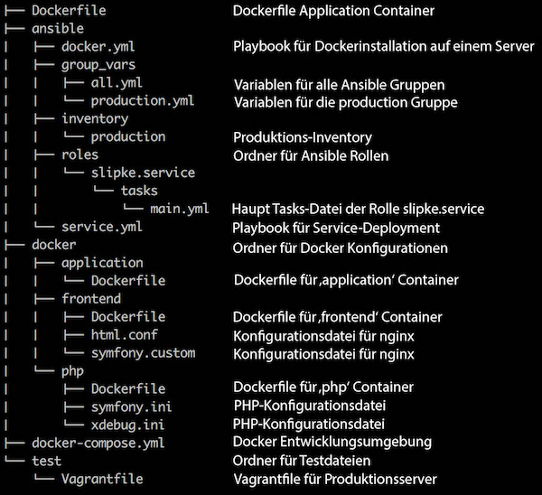

# Abstract

Ein wichtiges neues Konzept im "Ultra Large Scale Systems"-Bereich ist die Containerisierung von Anwendungen. 
Hierbei werden Anwendungen in viele kleine Dienste zerbrochen (sog. "Microservices") und in Containern verpackt. 
Jeder einzelne Container beinhaltet ausschließlich die für den Dienst benötigten Abhängigkeiten. Diese Container können 
dann in einer Produktionsumgebung auf unterschiedliche Server verteilt werden, wodurch eine hohe Flexibilität und 
Saklierbarkeit der einzelnen Dienste entsteht. In diesem Paper wird eine einfache "Hello-World"-Anwendung in einer 
lokalen Entwicklungsumgebung erstellt, in einen Docker-Container verpackt und in einer Produktionsumgebung ausgerollt. 
Es wird die Plattform Ansible verwendet, um die Produktionsumgebung automatisiert aufzusetzen und die Anwendung auf den 
Produktionsserver zu deployen. Dadurch entsteht eine solide Grundlage für die spätere Erweiterung und Skalierung der 
Produktionsumgebung. Um den Container zu erstellen wird die Plattform Docker in der aktuellen Version genutzt. 
Im Anschluss werden kurz weitere Tools vorgestellt, mit welchen die Produktionsumgebung weiter optimiert werden kann.

# Aufbau

# Autor

Name: Simon Lipke

E-Mail: sl110@hdm-stuttgart.de

Hochschule: [Hochschule der Medien](https://www.hdm-stuttgart.de)